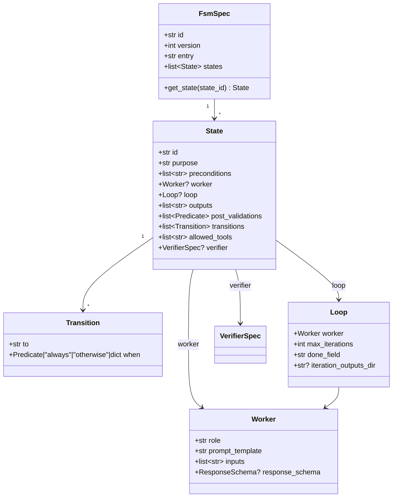

# Python API Reference

The `ctxr.fsm` package exposes two layers:

- **Pure core** (`ctxr.fsm.core`) — Pydantic spec primitives plus stateless engine functions. No I/O, no database, safe to import anywhere `pydantic` is installed.
- **SQLite substrate** (`ctxr.fsm.sqlite`) — a single `Project` facade that wires a SQLAlchemy engine to every sub-repository.

For higher-level surfaces see [cli.md](cli.md), [mcp.md](mcp.md), and [http.md](http.md). For the data model behind the repos see [schema.md](schema.md).

## Import surface

The top-level package re-exports every public name from `ctxr.fsm.core` so the common imports are flat:

```python
from ctxr.fsm import (
    FsmSpec, State, Transition, Worker, Loop, Predicate,
    ResponseSchema, VerifierSpec,
    Brief, WorkerOutput, RunCtx,
    advance, build_brief, loop_decide,
    aggregate_loop_outputs, aggregate_across_states,
    validate_fsm_spec, fsm_spec_hash,
)
from ctxr.fsm.sqlite import Project, run_migrations
```

`__version__` is published on the top-level module.

```
ctxr.fsm                  ergonomic re-exports of ctxr.fsm.core
├── core/                  pure spec + engine (no I/O)
├── sqlite/                Project facade + sub-repos
├── api/                   FastAPI app (see http.md)
├── cli/                   Click commands (see cli.md)
└── mcp/                   MCP tool surface (see mcp.md)
```

## The Project facade

`Project` is the single handle higher layers hold per database. It owns one `Engine`, one `sessionmaker`, and one instance of every sub-repository.

### Lifecycle

```python
from pathlib import Path
from ctxr.fsm.sqlite import Project

with Project.open(Path("./fsm.db"), migrate=True) as proj:
    spec_handle = proj.register_spec(my_spec, project_slug="default")
    run = proj.start_run(spec_handle.spec.id)
    print(run.id, run.status)
```

| Constructor | Use when |
| --- | --- |
| `Project.open(db_path, *, migrate=True, echo=False)` | Canonical entry point. Runs `alembic upgrade head` first when `migrate=True`. |
| `Project.from_engine(engine, *, session_factory=None)` | Tests with a pre-built in-memory engine. |
| `Project(engine, *, session_factory=None)` | Advanced: inject your own engine + sessionmaker. |
| `run_migrations(db_path)` | Standalone migration (e.g. deploy script booting the API server). |

### Convenience operations

| Method | Returns | Notes |
| --- | --- | --- |
| `register_spec(spec, *, project_slug="default")` | `SpecRegistered` | Get-or-create project, then insert-or-dedupe spec. |
| `start_run(spec_id, args=None)` | `Run` | Atomic: run row + producer upsert + `run_started` event in one txn. |
| `get_run(run_id)` | `Run \| None` | Pass-through to `RunsRepo.get`. |
| `subscribe(consumer_name, kinds=None, filter_run_id=None, *, poll_interval_seconds=0.25, stop_after=None)` | `Iterator[Event]` | At-least-once. Cursor persisted per consumer name. |
| `transaction(*, run_id)` | `TransactionContext` | Engine-bound unit-of-work for `@atomic`-decorated callables. |
| `close()` / `__exit__` | — | Idempotent. Restores the previous sessionmaker binding. |

`proj.engine` and `proj.session_factory` are exposed for raw queries or explicit session management.

## Sub-repository catalog

Every sub-repo is a stateless class hung off the `Project`. Methods take an explicit `Session` (open one with `proj.session_factory()` or via `@atomic`) so callers stay in control of transactions.

### Core lifecycle — `proj.projects`, `proj.specs`, `proj.runs`, `proj.run_sessions`

| Repo | Method | Purpose |
| --- | --- | --- |
| `ProjectsRepo` | `create(session, *, slug)` | Insert a project row. |
| | `get(session, id)` / `get_by_slug(session, slug)` | Lookup. |
| | `list(session)` | All projects, slug-ordered. |
| `SpecsRepo` | `register(session, *, spec, project_id)` | Insert-or-dedupe by `fsm_spec_hash`. |
| | `get(session, spec_id)` / `list_versions(session, project_id, fsm_id)` | Lookup + history. |
| `RunsRepo` | `create(session, *, project_id, spec_id, args, fsm_spec_hash)` | Seed `in_progress`. |
| | `get(session, run_id)` | Single run. |
| | `latest` / `incomplete` / `resumable` / `aborted` / `failed` / `completed` / `by_status` / `by_session` / `by_project` | Filtered `RunSummary` lists. |
| | `state_tree(session, run_id)` | Nested `StateNode` (states + transitions + artifacts). |
| | `events(session, run_id, ...)` | Event journal for a run. |
| | `update_status(session, run_id, ...)` | Lifecycle transitions (`pause`, `resume`, `complete`, `abort`, `drift_pause`). |
| `RunSessionsRepo` | `open(session, *, run_id, ...)` / `close(session, ...)` | Wall-clock session bookkeeping. |

### State tree — `proj.states`, `proj.transitions`, `proj.worker_artifacts`, `proj.aggregates`

| Repo | Highlights |
| --- | --- |
| `StatesRepo` | `create`, `get`, `mark_exited`, `mark_faulted`, `list_by_run`, `next_entry_seq`. |
| `TransitionsRepo` | `create`, `by_status` (taken / pending / faulted). |
| `WorkerArtifactsRepo` | `create`, `by_state` — one row per worker dispatch (brief + outputs + commit signature reference). |
| `AggregatesRepo` | `create`, `get(session, run_id, field)` — materialised loop / cross-state aggregates. |

### Concurrency + journal — `proj.locks`, `proj.journal`

```python
with proj.session_factory() as session, session.begin():
    res = proj.locks.acquire(session, run_id=run.id, holder="worker-1", ttl_seconds=60)
    if res.acquired:
        txn = proj.journal.open(session, run_id=run.id)
        # ... build outputs ...
        proj.journal.mark_ready(session, txn_id=txn.id, payload={...})
        proj.journal.finalise(session, txn_id=txn.id)
        proj.locks.release(session, run_id=run.id, holder="worker-1")
```

| Repo | Methods |
| --- | --- |
| `LocksRepo` | `acquire`, `release`, `inspect` — per-run exclusive lock with TTL + staleness. |
| `JournalRepo` | `open`, `mark_ready`, `finalise`, `discard`, `inspect` — two-phase commit envelope for worker outputs. |

### Enforcement — `proj.commit_signatures`, `proj.commit_tokens`, `proj.tool_calls`, `proj.drift_signals`

| Repo | Methods |
| --- | --- |
| `CommitSignaturesRepo` | `record`, `last_for_run` — persists `CommitSignature` envelopes. |
| `CommitTokensRepo` | `issue`, `consume`, `expire_stale` — single-use tokens authorising a transition commit. |
| `ToolCallsRepo` | `record`, `by_run` — observed worker tool calls (for allowlist enforcement). |
| `DriftSignalsRepo` | `record`, `by_run`, `score_for_run` — typed drift signals + aggregate score. |

See [enforcement.md](enforcement.md) for the full enforcement model.

### Event bus — `proj.producers`, `proj.consumers`, `proj.events`, `proj.event_deliveries`

| Repo | Methods |
| --- | --- |
| `ProducersRepo` | `upsert(session, *, kind, name)`, `get`, `list`. |
| `ConsumersRepo` | `register(session, *, kind, name, filter_kind=None, filter_run_id=None)`, `get`, `list`, `touch_last_seen`. |
| `EventsRepo` | `emit(session, *, producer_id, kind, payload, run_id=None)`, `by_producer`, `by_run`, `by_kind`. |
| `EventDeliveriesRepo` | `pending_for`, `mark_delivered`, `ack`, `fail`. |

`Project.subscribe` is the high-level wrapper that owns the polling loop; reach for these directly when building custom consumers.

## Spec primitives

All spec types are frozen Pydantic models with `extra="forbid"`. Construction validates eagerly.



### Quick reference

| Type | Required fields | Notes |
| --- | --- | --- |
| `FsmSpec` | `id`, `entry`, `states` | `entry` must be a known state id; ids unique. |
| `State` | `id` | `id` matches `^[a-z][a-z0-9_]*$`. `worker` and `loop` are mutually exclusive. |
| `Worker` | `role`, `prompt_template` | `response_schema` is optional but required for loop done-field validation. |
| `Loop` | `worker`, `done_field` | `done_field` must appear in `worker.response_schema.properties`. |
| `Predicate` | `expression` | Accepts `Predicate("a == 1")` sugar. |
| `Transition` | `to`, `when` | `when` accepts `"always"`, `"otherwise"`, a `Predicate`, or a typed dict (`{"kind": "deterministic", "expression": ...}` / `{"kind": "judgement", "criteria": ..., "evidence_required": ...}`). |
| `ResponseSchema` | `schema` (aliased to `schema_` in Python) | Wraps a JSON Schema dict; `model_validate_json_payload(payload)` validates with Draft 2020-12. |
| `VerifierSpec` | `role`, `prompt_template`, `response_schema` | `parallel_count >= majority_threshold >= 1`. |

### Enums (StrEnum)

| Enum | Members |
| --- | --- |
| `RunStatus` | `in_progress`, `paused`, `faulted`, `completed`, `aborted`, `superseded`, `drift_paused`. |
| `StateStatus` | `entered`, `exited`, `faulted`. |
| `TransitionKind` | `always`, `otherwise`, `deterministic`, `judgement`. |
| `EventKind` | 25 members; see [events.md](events.md). |
| `DeliveryStatus` | `pending`, `delivered`, `acked`, `failed`. |
| `SignalKind` | Drift taxonomy (`off_allowlist_tool_call`, `repeated_validation_failed`, …). |
| `VerifierVerdict` | `passed`, `rejected`, `inconclusive`. |

### Engine value objects

`Brief`, `WorkerOutput`, `CommitSignature`, `CommitToken`, `ValidationResult`, `PostValidationResult`, `TransitionEvaluation`, `LoopDecision`, `RunCtx`, `AllowedTools` — all frozen Pydantic models. `CommitSignature.compute(...)` and `CommitToken.issue(...)` are the canonical constructors.

## Stateless engine functions

These live in `ctxr.fsm.core` and have no I/O. They take a spec + context + outputs and return a result.

| Function | Purpose |
| --- | --- |
| `build_brief(spec, run_ctx, *, iteration_n=None) -> Brief` | Render the work brief for the current state / iteration. |
| `advance(spec, run_ctx, outputs, judgement_pick=None) -> EngineAdvanceResult` | One engine step: validate outputs, evaluate transitions, return next brief or terminal verdict. |
| `loop_decide(spec, run_ctx, outputs) -> LoopDecision` | Loop continuation check. |
| `aggregate_loop_outputs(...)` / `aggregate_across_states(...)` | Materialise the aggregator fields workers consume. |
| `validate_fsm_spec(spec) -> FsmValidationResult` | Static validation (referential integrity, predicate parseability). |
| `fsm_spec_hash(spec) -> str` | Canonical SHA-256 hash used by `SpecsRepo.register`. |
| `evaluate_expression(expr, env)` / `validate_expression(expr)` | Predicate DSL helpers. |
| `run_verifier(...)` / `get_verifier_handler` / `set_verifier_handler` | Verifier panel plumbing. |

## End-to-end: build, start, drive a run

```python
from pathlib import Path
from ctxr.fsm import FsmSpec, State, Transition, Worker, ResponseSchema, RunCtx, advance
from ctxr.fsm.sqlite import Project

spec = FsmSpec(
    id="hello_pipeline", entry="greet",
    states=[
        State(
            id="greet",
            worker=Worker(
                role="greeter", prompt_template="Say hi to {name}",
                response_schema=ResponseSchema(schema={
                    "type": "object", "required": ["greeting"],
                    "properties": {"greeting": {"type": "string"}},
                }),
            ),
            outputs=["greeting"],
            transitions=[Transition(to="done", when="always")],
        ),
        State(id="done"),
    ],
)

with Project.open(Path("./hello.db")) as proj:
    handle = proj.register_spec(spec)
    run = proj.start_run(handle.spec.id, args={"name": "world"})

    ctx = RunCtx(run_id=run.id, fsm_id=spec.id, current_state=spec.entry,
                 env={"name": "world"})
    result = advance(spec, ctx, outputs={"greeting": "hi world"})
    print(result.kind, getattr(result, "verdict", None))
```

The same engine call is what the [CLI](cli.md), [MCP server](mcp.md), and [HTTP API](http.md) drive — only the transport differs.
