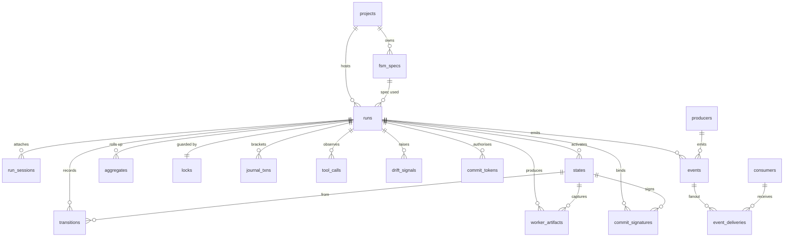

# Data Model

Reference for every table in the `ctxr.fsm` SQLite store, the enum vocabularies that flow through them, the event-bus shape, and the atomic-tx journal contract.

All tables are **SQLite STRICT** with **UUIDv7** primary keys stored as `TEXT(36)`, ISO-8601 UTC text timestamps (`YYYY-MM-DDTHH:MM:SS.sssZ`), and JSON columns stored as canonical `TEXT`. See [storage.md](storage.md) for the persistence contract and [migrations.md](migrations.md) for alembic conventions.

## ER Diagram



## Core Lifecycle Tables

Defined in `ctxr/fsm/sqlite/models_core.py`. These are the mutable surface backing a run.

### `projects`

The outermost grouping. Specs and runs live under a project.

| Column | Type | Purpose |
| --- | --- | --- |
| `id` | TEXT PK | UUIDv7 |
| `slug` | TEXT UNIQUE | Stable handle (e.g. `ctxr-dev`) |
| `created_at` | TEXT | ISO-8601 UTC |
| `metadata_json` | TEXT | Free-form JSON object |

### `fsm_specs`

A versioned, content-addressed FSM definition. `hash` is `fsm_spec_hash(definition)` — the spec's content identity, independent of its surrogate `id`.

| Column | Type | Purpose |
| --- | --- | --- |
| `id` | TEXT PK | UUIDv7 |
| `project_id` | TEXT FK → projects | CASCADE |
| `slug` | TEXT | Natural name within project |
| `version` | INTEGER >= 1 | Monotonic per (project, slug) |
| `hash` | TEXT | SHA-256 of canonical spec |
| `definition_json` | TEXT | Canonical spec JSON |
| `created_at` | TEXT | ISO-8601 UTC |

UNIQUE `(project_id, slug, version)`.

### `runs`

A single execution of a spec. `fsm_spec_hash` is the **hash lock** — the spec hash observed at run start, used by the engine to detect mid-run drift (see [enforcement.md](enforcement.md)).

| Column | Type | Purpose |
| --- | --- | --- |
| `id` | TEXT PK | UUIDv7 |
| `project_id` | TEXT FK → projects | |
| `fsm_spec_id` | TEXT FK → fsm_specs | |
| `fsm_spec_hash` | TEXT | Hash lock for drift detection |
| `status` | TEXT | `RunStatus` value |
| `current_state` / `next_state` | TEXT? | FSM state names |
| `verdict` | TEXT? | Terminal verdict on completion |
| `started_at` / `ended_at` / `last_update_at` | TEXT | Lifecycle timestamps |
| `paused_at` / `pause_reason` | TEXT? | Set when status=paused |
| `parent_run_id` | TEXT? FK → runs | Resume/supersede lineage |
| `resume_history_json` | TEXT | JSON array of resume points |
| `args_json` / `metadata_json` | TEXT | Run inputs + free-form metadata |
| `transitions_count` | INTEGER | Hot counter for read paths |

### `run_sessions`

A worker (or operator) attachment to a run. One row per acquire/release cycle; `released_at IS NULL` means "currently attached".

| Column | Type | Purpose |
| --- | --- | --- |
| `id` | TEXT PK | UUIDv7 |
| `run_id` | TEXT FK → runs | CASCADE |
| `session_id` | TEXT | External session handle |
| `acquired_at` / `released_at` | TEXT/TEXT? | Lifecycle |
| `release_reason` | TEXT? | Why released |

### `states`

One row per state **activation**. `entry_seq` is the per-run monotonic counter that totally orders activations even when timestamps tie.

| Column | Type | Purpose |
| --- | --- | --- |
| `id` | TEXT PK | UUIDv7 |
| `run_id` | TEXT FK → runs | CASCADE |
| `state_id` | TEXT | FSM state name |
| `entry_seq` | INTEGER | Per-run monotonic |
| `entered_at` / `exited_at` | TEXT/TEXT? | Lifecycle |
| `status` | TEXT | `StateStatus` value |
| `inputs_json` / `outputs_json` | TEXT | Bag in/out |
| `iteration_n` | INTEGER? | Non-NULL only inside loop states |

UNIQUE `(run_id, entry_seq)`.

### `transitions`

A taken transition between two state entries.

| Column | Type | Purpose |
| --- | --- | --- |
| `id` | TEXT PK | UUIDv7 |
| `run_id` | TEXT FK → runs | CASCADE |
| `from_state_id` | TEXT FK → states | Source **entry row** |
| `to_state_id` | TEXT | Destination **FSM state name** (may not yet exist) |
| `kind` | TEXT | `TransitionKind` value |
| `predicate` | TEXT? | Predicate DSL source |
| `predicate_result` | INTEGER? | 0/1 (STRICT-safe) |
| `decided_at` | TEXT | ISO-8601 UTC |

### `worker_artifacts`

Captured prompt + structured response per state entry. Multiple rows per state when running a loop.

| Column | Type | Purpose |
| --- | --- | --- |
| `id` | TEXT PK | UUIDv7 |
| `run_id` / `state_id` | TEXT FKs | CASCADE on run |
| `iteration_n` | INTEGER? | Loop iteration index |
| `prompt_text` / `prompt_hash` | TEXT | Captured prompt + SHA-256 |
| `output_json` | TEXT | Structured worker response |
| `validated` | INTEGER | 0/1 (STRICT-safe) |
| `created_at` | TEXT | |

### `aggregates`

Persisted across-state aggregation results. `from_state_ids_json` is the lineage so results are reconstructible without re-running the aggregator.

| Column | Type | Purpose |
| --- | --- | --- |
| `id` | TEXT PK | UUIDv7 |
| `run_id` | TEXT FK → runs | CASCADE |
| `field` | TEXT | Bag-path the aggregate feeds |
| `from_state_ids_json` | TEXT | JSON array of source `states.id` |
| `merged_length` | INTEGER | Item count |
| `items_json` | TEXT | Merged items |
| `created_at` | TEXT | |

### `locks`

Advisory per-run write lock. `run_id` is **both** the PK and FK — at most one lock per run.

| Column | Type | Purpose |
| --- | --- | --- |
| `run_id` | TEXT PK FK → runs | CASCADE |
| `holder_session_id` | TEXT | Current lease holder |
| `acquired_at` / `expires_at` | TEXT | Lease window |

## Event Bus Tables

Defined in `ctxr/fsm/sqlite/models_events.py`. See [event-bus.md](event-bus.md) for usage.

### `producers` / `consumers`

Registered subsystems on the bus. Both keyed by `(kind, name)` UNIQUE.

| Producers | Consumers |
| --- | --- |
| `id`, `kind`, `name`, `metadata_json`, `created_at` | `id`, `kind`, `name`, `filter_kind` (CSV of EventKind), `filter_run_id` (NULL = all runs), `created_at`, `last_seen_at` |

### `events`

Append-only log. `seq` is per-run monotonic — enforced by a **partial UNIQUE index** `(run_id, seq) WHERE run_id IS NOT NULL`. Run-less events (e.g. `producer_registered`) carry `seq = NULL` and live on the global `created_at` timeline.

| Column | Type | Purpose |
| --- | --- | --- |
| `id` | TEXT PK | UUIDv7 |
| `run_id` | TEXT? FK → runs | CASCADE; NULL for global events |
| `kind` | TEXT INDEXED | `EventKind` value |
| `producer_id` | TEXT FK → producers | |
| `payload_json` | TEXT | Event body |
| `created_at` | TEXT INDEXED | ISO-8601 UTC |
| `seq` | INTEGER? | Per-run monotonic |

### `event_deliveries`

Per-`(event, consumer)` ledger with composite PK — the at-most-once guarantee is structural.

| Column | Type | Purpose |
| --- | --- | --- |
| `event_id` | TEXT PK FK → events | CASCADE |
| `consumer_id` | TEXT PK FK → consumers | CASCADE |
| `delivered_at` / `acked_at` | TEXT? | Lifecycle |
| `status` | TEXT INDEXED | `DeliveryStatus` value |
| `attempts` | INTEGER | Retry counter |

## Enforcement Tables

Defined in `ctxr/fsm/sqlite/models_enforcement.py`. The auditable shell around each commit. See [enforcement.md](enforcement.md).

### `journal_txns`

Brackets the staged writes around a state-commit; statuses are `pending → ready_to_finalise → finalised | discarded` (see `JournalTxnStatus`).

| Column | Type | Purpose |
| --- | --- | --- |
| `id` | TEXT PK | UUIDv7 |
| `run_id` | TEXT FK → runs | CASCADE |
| `status` | TEXT | `JournalTxnStatus` |
| `staged_writes_json` | TEXT | JSON array of staged writes |
| `started_at` / `ready_at` / `finalised_at` | TEXT/TEXT?/TEXT? | Lifecycle |

### `tool_calls`

Every tool invocation observed. `args_redacted_json` has secrets/credentials/blobs scrubbed by the producer.

| Column | Type | Purpose |
| --- | --- | --- |
| `id` | TEXT PK | UUIDv7 |
| `run_id` | TEXT? FK → runs | NULL = pre-run |
| `producer_id` | TEXT FK → producers | |
| `tool_name` | TEXT INDEXED | |
| `args_redacted_json` | TEXT | Scrubbed args |
| `succeeded` | BOOLEAN | |
| `created_at` | TEXT INDEXED | |

### `drift_signals`

Typed signals the drift aggregator scores against a pause threshold.

| Column | Type | Purpose |
| --- | --- | --- |
| `id` | TEXT PK | UUIDv7 |
| `run_id` | TEXT FK → runs | CASCADE |
| `producer_id` | TEXT FK → producers | |
| `signal_kind` | TEXT INDEXED | `SignalKind` value |
| `weight` | REAL | Aggregator score weight (default 1.0) |
| `payload_json` | TEXT | Signal-specific context |
| `created_at` | TEXT | |

### `commit_signatures`

SHA-256 commitment binding `inputs_hash + outputs_hash + session_id + brief_id` at commit time.

| Column | Type | Purpose |
| --- | --- | --- |
| `id` | TEXT PK | UUIDv7 |
| `run_id` / `state_id` | TEXT FKs | |
| `iteration_n` | INTEGER? | Non-NULL inside loops |
| `brief_id` | TEXT | |
| `inputs_hash` / `outputs_hash` / `signature` | TEXT(64) | Hex SHA-256 |
| `session_id` | TEXT | |
| `verified` | BOOLEAN | Server recomputation matched |
| `created_at` | TEXT | |

### `commit_tokens`

Short-lived single-use tokens authorising a commit. Default TTL 60 s. PK **is** the token (UUIDv7).

| Column | Type | Purpose |
| --- | --- | --- |
| `token` | TEXT PK | UUIDv7 |
| `run_id` | TEXT FK → runs | CASCADE |
| `state_id` | TEXT | |
| `expected_next_state` | TEXT | Prevents replay against new state |
| `expires_at` | TEXT INDEXED | Reaper scan target |
| `consumed_at` | TEXT? | Set atomically with commit flush |

## Index Catalogue

Named indexes (composite or partial) declared in `__table_args__`:

| Index | Table | Columns | Use |
| --- | --- | --- | --- |
| `idx_runs_status_last_update` | runs | `status, last_update_at DESC` | "What's happening now" |
| `idx_runs_project_started` | runs | `project_id, started_at DESC` | Per-project history |
| `idx_runs_parent` | runs | `parent_run_id` | Resume/supersede lookup |
| `idx_fsm_specs_unique` | fsm_specs | `project_id, slug, version` UNIQUE | Natural identity |
| `idx_run_sessions_run` | run_sessions | `run_id, session_id` | Session lookup |
| `idx_states_run_seq` | states | `run_id, entry_seq` UNIQUE | Activation ordering |
| `idx_transitions_run_from` | transitions | `run_id, from_state_id` | Transition timeline |
| `idx_events_run_seq` | events | `run_id, seq` UNIQUE WHERE `run_id IS NOT NULL` | Per-run monotonicity |
| `ix_events_run_id`, `ix_events_kind`, `ix_events_producer_id`, `ix_events_created_at` | events | single-column | Common filters |
| `idx_event_deliveries_consumer_pending` | event_deliveries | `consumer_id, status, delivered_at` | Bus poll loop |
| `idx_journal_run_status` | journal_txns | `run_id, status` | Recovery scan |
| `idx_commit_signatures_run` | commit_signatures | `run_id, created_at` | Commit timeline |

## Status Enums

All enums are `StrEnum` (`ctxr/fsm/core/models.py`, `ctxr/fsm/core/protocols.py`). Stored as TEXT; validated at the repository boundary.

```python
class RunStatus(StrEnum):
    in_progress = "in_progress"
    paused = "paused"
    faulted = "faulted"
    completed = "completed"
    aborted = "aborted"
    superseded = "superseded"
    drift_paused = "drift_paused"   # raised by the drift aggregator

class StateStatus(StrEnum):
    entered = "entered"
    exited = "exited"
    faulted = "faulted"

class TransitionKind(StrEnum):
    always = "always"
    otherwise = "otherwise"
    deterministic = "deterministic"
    judgement = "judgement"

class DeliveryStatus(StrEnum):
    pending = "pending"
    delivered = "delivered"
    acked = "acked"
    failed = "failed"

class SignalKind(StrEnum):
    off_allowlist_tool_call = "off_allowlist_tool_call"
    repeated_validation_failed = "repeated_validation_failed"
    signature_mismatch = "signature_mismatch"
    verifier_rejection = "verifier_rejection"
    output_shape_near_miss = "output_shape_near_miss"
    idle_too_long = "idle_too_long"

class VerifierVerdict(StrEnum):
    passed = "passed"
    rejected = "rejected"
    inconclusive = "inconclusive"

class JournalTxnStatus(StrEnum):
    pending = "pending"
    ready_to_finalise = "ready_to_finalise"
    finalised = "finalised"
    discarded = "discarded"

class LockAcquisitionStatus(StrEnum):
    acquired = "acquired"
    contended = "contended"
    reentrant = "reentrant"
    taken_over = "taken_over"
```

`EventKind` is the closed taxonomy of events on the journal — full list in [event-bus.md](event-bus.md).

## Event Shape

Every row in `events` decodes to:

```python
{
    "id":          "01949b9c-...",        # UUIDv7
    "run_id":      "01949b9b-..." | None,  # None for global events
    "kind":        "state_entered",        # EventKind value
    "producer_id": "01949b9a-...",
    "payload_json": { ... },               # event-kind-specific JSON
    "seq":         42 | None,              # per-run monotonic; None when run_id is None
    "created_at":  "2026-05-30T12:34:56.789Z",
}
```

The bus produces one `event_deliveries` row per matching consumer; the consumer's `filter_kind` (CSV of `EventKind`) and `filter_run_id` (NULL = all runs) decide matching.

## Atomic-Tx Journal Model

The journal is the engine's pre-commit ledger. Every state-commit follows the same lifecycle:

```
                 ┌──────────────────┐
                 │   state entered  │
                 └────────┬─────────┘
                          │ open()
                          ▼
                ┌────────────────────┐
       ┌────────┤  status = pending  │◄──── staged_writes accumulate
       │        └─────────┬──────────┘
       │ discard()        │ mark_ready()
       │                  ▼
       │      ┌───────────────────────────┐
       │      │ status = ready_to_finalise │
       │      └─────────────┬─────────────┘
       │                    │ finalise()  (atomic flush)
       │                    ▼
       │      ┌───────────────────────────┐
       │      │     status = finalised    │
       │      └───────────────────────────┘
       ▼
┌──────────────────┐
│ status = discarded│   (recovery / abort)
└──────────────────┘
```

Rules:

- Each state-commit opens **exactly one** `journal_txns` row, bracketing all writes for that commit.
- `staged_writes_json` accumulates while `status = pending`. The worker never touches target tables directly.
- `mark_ready()` flips to `ready_to_finalise` once enforcement (signature verification, drift score, commit-token validation) signs off.
- `finalise()` flushes staged writes atomically and stamps `finalised_at`. The session's surrounding `@atomic` transaction makes the flush + status update one unit of work.
- A crash mid-commit leaves the row in `pending` or `ready_to_finalise`. The engine's recovery path (driven by `idx_journal_run_status`) finds these on startup and either replays (`ready_to_finalise`) or discards (`pending`).
- `discarded` is terminal — the txn is closed without flushing. Useful for aborted runs and recovery.

See [enforcement.md](enforcement.md) for the full commit pipeline, [recovery.md](recovery.md) for crash semantics, and `ctxr/fsm/sqlite/repos_locks_journal.py` for the repository surface (`LocksRepo`, `JournalRepo`).
