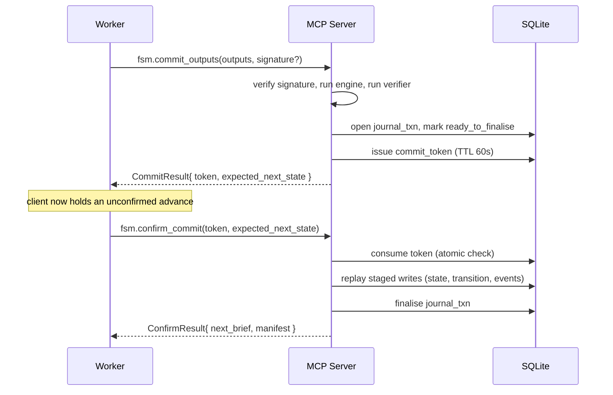

# MCP Tool Catalog

The `ctxr-fsm mcp` server exposes **17 tools** under the `fsm.*` namespace.
Every tool input and output is a Pydantic model; errors return a structured
`McpToolError` envelope rather than a JSON-RPC error frame so legacy clients
keep working unchanged.

- **Meta + bootstrap** (4): `fsm.healthcheck`, `fsm.list_specs`,
  `fsm.register_spec`, `fsm.observe_tool_call`
- **Run lifecycle** (8): `fsm.start_run`, `fsm.get_brief`,
  `fsm.commit_outputs`, `fsm.confirm_commit`, `fsm.resume_run`,
  `fsm.abort_run`, `fsm.list_runs`, `fsm.get_run`
- **Events + journal** (5): `fsm.subscribe_events`, `fsm.inspect_journal`,
  `fsm.recover_journal`, `fsm.list_consumers`, `fsm.list_producers`

See also: [Architecture](./architecture.md), [Two-phase commit](./two-phase-commit.md),
[Events](./events.md), [Drift detection](./drift.md).

## Error envelope

Every tool returns either its typed result model **or** an `McpToolError`
with fields `error` (snake_case code), `detail` (human-readable), and
optional `payload` (per-code extras):

```json
{ "error": "spec_not_found",
  "detail": "no registered spec with id '01HF…'",
  "payload": { "spec_id": "01HF…" } }
```

Common codes: `project_not_bound`, `run_not_found`, `spec_not_found`,
`invalid_state`, `fsm_spec_changed`, `signature_required`,
`signature_mismatch`, `verifier_rejected`, `commit_token_invalid`,
`journal_not_ready`, `server_draining`, `internal_error`.

## Meta + bootstrap

### `fsm.healthcheck`

Read-only probe. Used by skill pre-checks (common-dev *Principle 1*) to
confirm the server is up before any mutating call.

**Input:** none.
**Output:** `HealthcheckResult { status, db_path, sqlite_version, alembic_revision, package_version }`

```json
// response
{
  "status": "ok",
  "db_path": "/var/lib/ctxr-fsm/project.db",
  "sqlite_version": "3.45.1",
  "alembic_revision": "0007_w12_enforcement",
  "package_version": "0.4.0"
}
```

Errors: `project_not_bound`, `internal_error`.

### `fsm.list_specs`

Enumerate registered specs as trimmed summaries (no `definition` body).
Sorted by `(project_slug, slug, version)` ascending.

**Output:** `list[SpecSummary { id, project_id, project_slug, slug, version, hash, created_at }]`

### `fsm.register_spec`

Parse a JSON spec, run cross-cutting validation (reachability, dangling
transitions, loop `done_field`, predicate parsability), and persist.
Byte-identical re-registrations are idempotent (`created=False`).

**Input:** `definition_json: str`, `project_slug: str = "default"`
**Output:** `SpecRegisteredPayload { spec_id, hash, version, slug, project_id, project_slug, created }`

Errors: `invalid_spec_definition` (Pydantic), `schema_validation_failed`
(structural — payload carries the full `FsmValidationResult`).

### `fsm.observe_tool_call`

Layer-7 drift signal. The agent reports every **non-`fsm.*`** tool call it
made during an active run; W12 reads these rows to compute drift scores.
See [Drift detection](./drift.md).

**Input:** `producer_kind`, `producer_name`, `tool_name`, `args_redacted: dict`,
`succeeded: bool = true`, `run_id: UUID | None = null`
**Output:** `ObserveResult { recorded, tool_call_id, event_id, producer_id }`

Arguments must be redacted **at the caller** — the server persists them verbatim.

## Run lifecycle

### `fsm.start_run`

Start a fresh run against a registered spec. Mints the run row, persists the
entry state, publishes the active-run marker for layer-4 enforcement.

**Input:** `StartRunInput { spec_id: UUID, args: dict = {} }`
**Output:** `RunStartedPayload { run_id: UUID, brief: Brief, fsm_spec_hash: str }`

```json
// example call
{ "spec_id": "01HF…", "args": { "user_query": "…" } }
```

Errors: `spec_not_found`, `internal_error`.

### `fsm.get_brief`

Build the Brief for the run's current state from `args` + every prior state's
exit outputs. Trips `fsm_spec_changed` if the spec has been re-registered
under the same slug with a different hash (W12 spec-hash lock).

**Input:** `GetBriefInput { run_id: UUID }`
**Output:** `Brief`

Errors: `run_not_found`, `spec_not_found`, `fsm_spec_changed`, `invalid_state`.

### `fsm.commit_outputs`

**Phase 1** of the two-phase commit. Drives the engine, runs the verifier
panel when the state declares one, stages writes in a `journal_txn` marked
`ready_to_finalise`, and mints a single-use `CommitToken`. The state-row +
transition-row + manifest update are **not** applied yet — the client must
call `fsm.confirm_commit` next.

**Input:**

| Field | Type | Notes |
|-------|------|-------|
| `run_id` | `UUID` | required |
| `outputs` | `dict[str, Any]` | worker outputs being committed |
| `signature` | `str \| None` | layer-5 cosignature (see below) |
| `brief_id` | `UUID \| None` | required iff `signature` set |
| `session_id` | `str \| None` | required iff `signature` set |

**Output:** `CommitResult`

| Field | Type | Notes |
|-------|------|-------|
| `kind` | `"advanced" \| "terminal" \| "fault" \| "loop_continued"` | discriminator |
| `brief` | `Brief?` | the *next* brief on advance / loop_continue |
| `next_state` | `str?` | new state id on advance |
| `iteration_n` | `int?` | loop iteration number |
| `verdict` | `Any` | terminal verdict |
| `reason`, `errors`, `evaluations`, `post_validations` | … | fault diagnostics |
| `token` | `CommitToken?` | present iff not `fault` |
| `expected_next_state` | `str?` | sentinel `"__terminal__"` for terminal |

Cosignature is required when the state declares `allowed_tools`, a `verifier`,
**or** `CTXR_FSM_REQUIRE_COSIGNATURE=1`. Compute as
`CommitSignature.compute(brief_id, inputs, outputs, session_id)`. See
[Commit signatures](./signatures.md).

Errors: `run_not_found`, `spec_not_found`, `fsm_spec_changed`, `invalid_state`,
`signature_required`, `signature_mismatch`, `verifier_rejected`,
`server_draining`, `internal_error`.

### `fsm.confirm_commit`

**Phase 2.** Validate + consume the token, replay the staged journal txn, mark
it finalised, emit `commit_token_consumed`, return the new manifest and next
brief.

**Input:** `ConfirmCommitInput { token: UUID, expected_next_state: str }`
**Output:** `ConfirmResult { confirmed: bool, note?, next_brief?, manifest? }`

Errors: `commit_token_invalid` (with `reason ∈ {missing, consumed, expired, state_mismatch}`),
`journal_not_ready`, `run_not_found`, `spec_not_found`, `internal_error`.

#### Two-phase commit flow



Properties:

- **Atomic**: a crash between phases leaves either a token+journal row or
  neither — never a half-applied advance.
- **Idempotent confirm**: re-presenting a consumed token returns
  `commit_token_invalid { reason: "consumed" }`.
- **Bounded**: tokens expire after 60s; an expired token emits
  `commit_token_expired` for the drift aggregator.
- **Verifier-gated**: a rejected verifier panel returns `verifier_rejected`
  *without* minting a token, so a bad commit cannot advance the run.

### `fsm.resume_run`

Resume a paused/faulted run. W4 ships the journal bookkeeping +
`run_resumed` event; engine-driven resume lands in W12.

**Input:** `ResumeRunInput { run_id: UUID, from_state?: str, journal?: "discard" | "replay" }`
**Output:** `ResumeResult { run_id, from_state?, journal_action?, journal_txn_id?, engine_resume }`

### `fsm.abort_run`

Mark a run aborted, emit `run_aborted`, clear the active-run marker.
Refuses runs already in a terminal status (`completed` / `aborted`).

**Input:** `AbortRunInput { run_id: UUID, reason?: str }`
**Output:** `AbortResult { run_id, previous_status, new_status: "aborted", ended_at, reason? }`

Errors: `run_not_found`, `invalid_state_transition`.

### `fsm.list_runs`

List runs, optionally filtered.

**Input:** `ListRunsInput { filter_status?: str, since?: str, limit: int = 50 }`
**Output:** `list[RunSummary]`

`filter_status` accepts any literal status (`running`, `completed`, …) plus
two special keywords: `incomplete` and `resumable`.

### `fsm.get_run`

Assemble the full per-run picture: manifest, state tree, last 50 events,
journal, locks.

**Input:** `GetRunInput { run_id: UUID }`
**Output:** `RunDetail { manifest, state_tree?, events, journal?, locks? }`

## Events + journal

### `fsm.subscribe_events`

Long-poll the event bus. The same `consumer_name` resumes the cursor on the
next call — registration is idempotent at `(kind, name)`.

**Input:**

| Field | Type | Default |
|-------|------|---------|
| `consumer_name` | `str` (≥1) | — |
| `kinds` | `list[str] \| None` | `null` (all) |
| `filter_run_id` | `UUID \| None` | `null` (all runs) |
| `max_events` | `int 1..1000` | `50` |
| `timeout_seconds` | `float (0, 60]` | `5.0` |

**Output:** `EventBatch { events: list[Event], next_cursor: null }`

An empty batch on timeout is a structured "still alive" response, not an
error. See [Events](./events.md) for the `Event` shape.

### `fsm.inspect_journal`

Read the newest unfinalised journal txn for a run.

**Input:** `run_id: UUID`
**Output:** `JournalState { run_id, txn: JournalTxn | null }`

### `fsm.recover_journal`

Operator hatch for a crash mid-commit.

**Input:** `run_id: UUID`, `action: "discard" | "replay"`
**Output:** `JournalRecovered { run_id, action, txn_id?, previous_status? }`

| `action` | Effect |
|----------|--------|
| `discard` | drop staged writes (rollback) |
| `replay` | mark txn `finalised` (roll-forward; W4 transitions status only, W12 wires re-materialisation) |

A run with no unfinalised txn returns a structured no-op (`txn_id=null`).

Errors: `journal_replay_not_ready` (pending-but-unstaged row).

### `fsm.list_consumers` / `fsm.list_producers`

Registry dumps for the dev loop / UI.

**Output:** `list[Consumer]` / `list[Producer]` (ordered by id ≈ registration order).

## Drain behaviour

The server's drain lifecycle (SIGTERM, hot reload) is built around three
guarantees:

1. **Reject new work.** Once `start_drain()` flips the flag, every tool body
   (wrapped by `@drain_aware`) returns the structured error:

   ```json
   { "error": "server_draining",
     "detail": "MCP server is draining; retry in a moment" }
   ```

2. **Wait for the in-flight tail.** `wait_for_drain()` polls the in-flight
   counter at 50ms cadence until it reaches zero or the budget elapses
   (default **30s**). A clean drain adds a 250ms settle window so the FastMCP
   transport can flush the just-completed call's response.

3. **Stable stderr banners.** A `[ctxr-fsm mcp]` prefix on both the start
   and end lines so the supervisor's log-tail regex stays simple.

```
[ctxr-fsm mcp] draining for reload (waiting up to 30s for in-flight tool calls)
[ctxr-fsm mcp] drain complete; goodbye
```

Every `fsm.*` tool is wrapped with `@drain_aware` — clients should treat
`server_draining` as a transient error and retry after a short backoff. See
[Server lifecycle](./server-lifecycle.md) for the supervisor contract.
