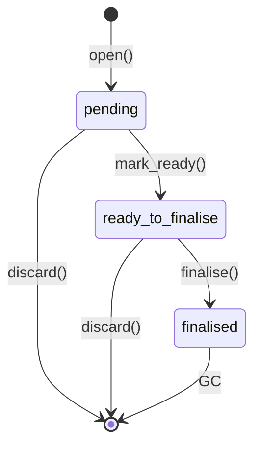

# Recovery

How `ctxr.fsm` survives crashes, races, and operator drift — and what to
do when it doesn't.

The substrate is built so that **every state-mutating unit of work is
bracketed by a journal txn**, **every writer takes a single-writer
lock**, and **every commit is signed against a spec hash**. When
something goes wrong, these primitives leave forensic breadcrumbs in
the SQLite database. This guide is the operator playbook for reading
and acting on those breadcrumbs.

See also: [atomic.md](atomic.md), [enforcement.md](enforcement.md),
[cli.md](cli.md), [mcp.md](mcp.md), [api.md](api.md).

---

## The journal model

Every commit attempt opens a row in `journal_txns` and walks it through
three statuses:

```
open()        →  status=pending,           started_at=now
mark_ready()  →  status=ready_to_finalise, ready_at=now,  staged_writes
finalise()    →  status=finalised,         finalised_at=now
discard()     →  row deleted
```



| Status              | Meaning                                                                 | Recoverable? |
|---------------------|-------------------------------------------------------------------------|--------------|
| `pending`           | Worker started, has not yet declared staged writes. No data committed.  | **Discard.**     |
| `ready_to_finalise` | Staged writes recorded; main txn committed; finalise marker not yet set.| **Replay.**      |
| `finalised`         | Quiescent; audit trail only.                                            | Nothing to do.   |

Why two phases? The journal row is opened in its own short txn so it
survives a main-txn abort. Without that two-step write-ahead-log
discipline, a crash mid-commit would erase the only trace of the
attempted work.

---

## When a `journal_txn` is left over

A row in `pending` or `ready_to_finalise` is the universal "we crashed
between two phases" signal. The next `@atomic`-wrapped call for the
same run will **refuse to start** and raise `JournalRefusedError`:

```
refusing to start atomic txn for run 'abc…':
an outstanding journal txn (id='018f…', status='pending')
exists and must be resolved via
`fsm run resume --journal {discard,replay}` first.
```

The operator must clear it before new work can flow.

### Inspect

| Surface | Command                                                       |
|---------|---------------------------------------------------------------|
| CLI     | `ctxr-fsm run show <run_id>` (journal section)                |
| CLI     | `ctxr-fsm runs ls --status incomplete`                        |
| MCP     | `fsm.inspect_journal { run_id }`                              |
| API     | `GET /api/v1/admin/journal_txns?status=pending`               |
| API     | `GET /api/v1/admin/journal_txns?status=ready_to_finalise`     |

Sample CLI output:

```
$ ctxr-fsm run show 7c3a…
journal
  id=018f… status=ready_to_finalise
  started=2026-05-29T12:34:56.789Z
  staged_writes=3
```

### Discard vs replay

| Action     | Use when                                                  | What it does                                                                  |
|------------|-----------------------------------------------------------|-------------------------------------------------------------------------------|
| `discard`  | Status is `pending` (no data was committed).              | Deletes the row. The run is back to "ready for fresh work".                   |
| `replay`   | Status is `ready_to_finalise` (data committed, marker lost). | Flips the row to `finalised`. **W4: status only**; engine re-materialisation lands in W12. |

```bash
# Roll back a half-started txn.
ctxr-fsm run resume <run_id> --journal discard

# Roll forward a committed-but-unfinalised txn.
ctxr-fsm run resume <run_id> --journal replay
```

MCP equivalent:

```jsonc
// tool: fsm.recover_journal
{ "run_id": "7c3a…", "action": "discard" }   // or "replay"
```

A `replay` against a `pending` row is refused with
`journal_replay_not_ready` — there are no staged writes to roll
forward.

---

## Spec hash drift error

When a run starts, the engine snapshots the spec's SHA-256 hash onto
the run row (`runs.fsm_spec_hash`). On every resume / commit, the
**spec-hash lock** (W12 layer 9) compares that snapshot against the
*current* latest version registered under the same `(project_id,
slug)`. A mismatch means an operator re-registered the spec mid-flight.

### How it surfaces

| Surface | Shape                                                                 |
|---------|-----------------------------------------------------------------------|
| MCP     | `{ error: "fsm_spec_changed", run_hash, current_hash }`               |
| API     | `HTTP 409 Conflict` with the same JSON body in `detail`.              |
| CLI     | The next `fsm run resume` propagates the MCP/API error verbatim.      |

Example API response:

```json
{
  "detail": {
    "error": "fsm_spec_changed",
    "detail": "FSM spec hash changed since run started",
    "run_hash":     "9af3…b1",
    "current_hash": "c102…7e"
  }
}
```

### Operator playbook

1. **Compare the hashes.** `ctxr-fsm spec show <slug>` prints the
   current registered version; `ctxr-fsm run show <id>` prints the
   run's snapshot.
2. **Decide intent.**
   - The spec change was intentional and the run is stale → abort the
     run: `ctxr-fsm run abort <id> --reason "spec rev'd"`.
   - The spec change was a mistake → re-register the original
     definition: `ctxr-fsm spec register <file>`; the run resumes
     cleanly.
3. **Never** edit `runs.fsm_spec_hash` by hand. The hash is the
   integrity contract; rewriting it strips the audit trail.

---

## Stale lock takeover

`locks` carries one row per actively-locked run, with a TTL
(`expires_at`). A live row means another writer holds the run; an
expired row means the previous writer crashed or stalled.

### Inspect

```bash
# CLI — surfaced via the doctor report.
ctxr-fsm doctor

# API — every held lock, freshest first.
curl -s http://localhost:8000/api/v1/admin/locks | jq
```

### Acquire / takeover behaviour

| Pre-state                            | Acquire result                          |
|--------------------------------------|------------------------------------------|
| no row                               | `acquired`                               |
| same session, any state              | `already_held_by_same_session` (heartbeat) |
| different session, **live**          | `held`, refused                          |
| different session, **expired**       | `replaced_stale`, taken over             |

`release` is the inverse and is owner-only: a foreign session calling
`release` gets `not_owner` and the row stays put. **Stealing a live
lock is never a release operation** — it goes through `acquire` on a
naturally-stale lease.

### Operator playbook

1. **Wait first.** Default TTL is 3600 s. If you suspect a true hang,
   confirm via `ctxr-fsm doctor` that the holder PID is dead.
2. **Let the next worker take over.** Any subsequent `acquire` from a
   new session on the same run will trip the `replaced_stale` path
   automatically. No operator action needed.
3. **Force-clear only as last resort.** If a lock is wedged on a row
   you know is abandoned, delete it directly:
   ```bash
   sqlite3 .ctxr/fsm.sqlite "DELETE FROM locks WHERE run_id = '7c3a…'"
   ```
   Then `ctxr-fsm run resume <id>` to re-emit the bookkeeping event.

---

## Drift-paused runs (W12)

The W12 drift detector scores each run's event stream against a
weighted taxonomy and auto-pauses runs whose cumulative score exceeds
`DriftConfig.score_threshold` (default 10.0). A paused run has
`runs.status = 'drift_paused'`.

```
flowchart LR
    Events --> Classify --> Score
    Score -- > threshold --> Pause[status=drift_paused]
    Score -- <= threshold --> Continue
```

### Signal weights (defaults)

| Signal kind                     | Weight | Trigger                                                  |
|---------------------------------|-------:|----------------------------------------------------------|
| `signature_mismatch`            | 8.0    | Cosignature mismatch on commit                           |
| `verifier_rejection`            | 6.0    | Verifier panel rejected the worker output                |
| `off_allowlist_tool_call`       | 5.0    | Tool not in state's `allowed_tools` (and not `fsm.*`)    |
| `repeated_validation_failed`    | 3.0    | 2nd+ consecutive `validation_failed`                     |
| `output_shape_near_miss`        | 2.0    | Output close to but not matching schema                  |
| `idle_too_long`                 | 1.0    | Run idle beyond `window_seconds` (default 60s)           |

### Inspect

| Surface | Command                                                         |
|---------|-----------------------------------------------------------------|
| CLI     | `ctxr-fsm runs ls --status drift_paused`                        |
| CLI     | `ctxr-fsm run show <run_id>` (recent events list)               |
| API     | `GET /api/v1/admin/drift_signals?run_id=<id>` (signals + score) |

Sample API response:

```json
{
  "run_id": "7c3a…",
  "score": 13.0,
  "signals": [
    { "kind": "off_allowlist_tool_call", "weight": 5.0, "payload": { "tool_name": "Bash" } },
    { "kind": "off_allowlist_tool_call", "weight": 5.0, "payload": { "tool_name": "Bash" } },
    { "kind": "repeated_validation_failed", "weight": 3.0 }
  ]
}
```

### Operator playbook

1. **Read the signals.** The list tells you *why* the run paused — a
   single off-allowlist `Bash` is noise, three is a worker that is
   systematically ignoring the contract.
2. **Decide.**
   - The signals are a false positive → adjust the spec
     (`allowed_tools`) or widen `DriftConfig.score_threshold`, then
     `ctxr-fsm run resume <id>`.
   - The signals are real → `ctxr-fsm run abort <id> --reason
     "drift confirmed"` and start a fresh run with a tightened spec.
3. **Kill switch.** Set `CTXR_FSM_DRIFT_DISABLED=1` and reload the
   supervisor to stop the loop entirely. Use sparingly — drift
   pausing is the last enforcement layer.

---

## Recovery cheat sheet

| Symptom                                          | Cause                                | Action                                                          |
|--------------------------------------------------|--------------------------------------|-----------------------------------------------------------------|
| `JournalRefusedError` on next call               | `pending` row left over              | `run resume --journal discard`                                  |
| `JournalRefusedError`, status `ready_to_finalise`| Commit landed, finalise marker lost  | `run resume --journal replay`                                   |
| HTTP 409 `fsm_spec_changed`                      | Spec re-registered mid-run           | Abort the run, or re-register the original spec                 |
| `acquire` returns `held` indefinitely            | Live lock by another session         | Wait for TTL; verify holder is dead via `doctor`                |
| `acquire` returns `replaced_stale`               | Previous holder crashed              | Nothing — takeover is automatic                                 |
| Run status `drift_paused`                        | Drift score above threshold          | Inspect `/admin/drift_signals`; resume or abort                 |
| `journal_replay_not_ready`                       | `replay` on a `pending` row          | Use `discard` instead                                           |

The substrate's golden rule: **never edit the journal, lock, or hash
columns by hand**. Every recovery path above goes through a CLI / MCP
/ API surface that emits the corresponding event so the audit trail
stays whole.
